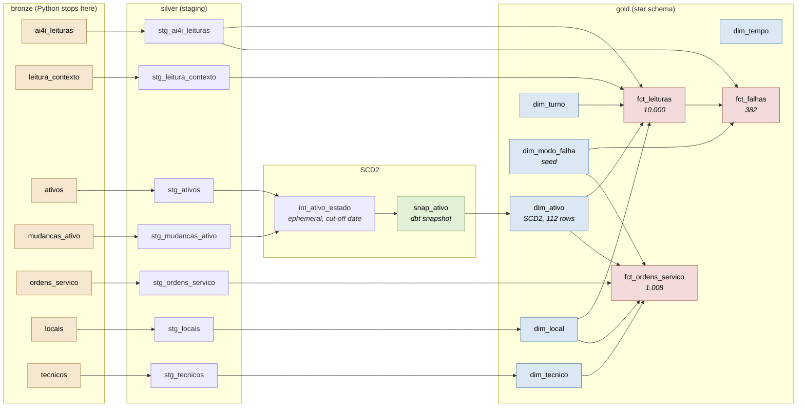

# maintenance-warehouse

A dimensional warehouse for industrial maintenance, built with dbt on PostgreSQL.
Sensor readings come from the public [AI4I 2020 dataset](https://archive.ics.uci.edu/dataset/601/ai4i+2020+predictive+maintenance+dataset)
(UCI, CC BY 4.0); the world around them (machines, calendar, work orders, technicians)
comes from a seeded generator. Python loads raw data into bronze and stops there. From
bronze on, every transformation is a dbt model.

That boundary is the point of the project. There is no `transform.py` here, and its
absence is deliberate: transformation lives in versioned, tested, documented SQL inside
the warehouse.

[Versão em português](README.pt-BR.md)

## Running it

```bash
docker compose up -d                                    # PostgreSQL
uv sync
uv run seed                                             # download, generate, load bronze
uv run --env-file .env dbt deps --project-dir warehouse --profiles-dir warehouse
bash scripts/historico_ativo.sh                         # builds the SCD2 history
uv run --env-file .env dbt build --project-dir warehouse --profiles-dir warehouse
```

The fourth step is not optional and it is not a wrapper around `dbt build`. A dbt
snapshot records what it sees when it runs, and `bronze.ativos` is static after load: the
31 registered cadastre changes do not become history on their own. The script shows dbt
the fleet as it stood on each change date, in ascending order, so the snapshot opens a
real version each time. Skipping it leaves one version per machine and a past that never
happened, so a test counts the versions and fails the build if the loop was skipped.

`uv run seed --sem-sujeira` loads the same data with the injected dirt turned off. The
build then goes to zero warnings, which is how the tests prove they are measuring
something.

## Lineage



For the navigable version with column-level docs and test coverage:

```bash
uv run --env-file .env dbt docs generate --project-dir warehouse --profiles-dir warehouse
uv run --env-file .env dbt docs serve    --project-dir warehouse --profiles-dir warehouse
```

## The star

Three facts and six dimensions. Grains are declared in
[`docs/modelo-dimensional.md`](docs/modelo-dimensional.md), along with what each grain
cannot answer, which matters as much as what it can.

| Table | Grain | Rows |
|---|---|---|
| `fct_leituras` | one operating cycle of one machine | 10.000 |
| `fct_falhas` | one failure mode of one reading | 382 |
| `fct_ordens_servico` | one work order | 1.008 |
| `dim_ativo` | one version of one machine over a validity range (**SCD2**) | 112 |
| `dim_tempo` | one day | 1.097 |
| `dim_local` | one production line | 13 |
| `dim_tecnico` | one technician | 13 |
| `dim_modo_falha` | one failure mode | 7 |
| `dim_turno` | one work shift | 3 |

Facts never join a dimension by its natural key. `dim_ativo` holds 111 versions of 80
machines, so `MAQ-066` alone identifies four rows. Resolving the key by natural code
instead of by the version valid on the event date turns 10.000 readings into 14.329, and
nothing errors: the cost just comes out higher.

## The five questions

The warehouse exists to be queried, and
[`warehouse/analyses/perguntas_negocio.sql`](warehouse/analyses/perguntas_negocio.sql)
is where that happens: five questions, each one carrying the SQL, the reasoning behind
every definition it needed, and the real psql output pasted underneath.

| # | Question | What came out |
|---|---|---|
| 1 | MTBF and MTTR by criticality | High criticality machines fail **less**: 184,6 days between failures against 146,5 for low criticality. Not because they are better looked after. |
| 2 | Which sectors concentrate corrective cost | Usinagem holds 40,8% of the cost and runs 39,9% of the cycles, so it is large, not expensive. Montagem is the real outlier, at R$ 84.039 per thousand cycles against Acabamento's R$ 46.090. |
| 3 | Which failure mode stops machines the longest | The two rankings are almost inverted. HDF is 30,5% of the orders and 19,4% of the downtime; OSF is 26,6% of the orders and 40,0% of the downtime. |
| 4 | Does preventive maintenance on time reduce corrective work next quarter | **No**, and the aggregate said yes. |
| 5 | How does cost per machine change after a refurbishment | Three go up, three go down. What matters is that the question can be asked at all. |

Three of those five answers turn out to measure the same thing by different routes, and
it is not maintenance. The AI4I ties the OSF threshold to the product type, so type L
machines fail more (4,12% against 2,49% for type H) and 87 of the 98 OSF occurrences
happen on type L. OSF is also the most expensive repair in the plant: R$ 2.967,64 of
parts on average against R$ 643,26 for HDF. The generator then draws each machine's
criticality **from its type**, and scatters machines across production lines at random.
Question 1 reads that chain as criticality and question 2 reads it as sector. Question 3
is the only one of the three that is really about maintenance.

Question 4 is the one worth reading in full. The aggregate came out in perfect order:
0,540 corrective orders in the following quarter when the preventive was on time, 0,661
when it was late, 0,758 when it never happened. Written down, that is "doing preventive
maintenance on time cuts corrective work by 29%", and every number in it is true.

Cutting the same result by quarter kills it. One quarter pair carries the entire
gradient, and removing it flips the order: machines that skipped preventive maintenance
end up with the **lowest** corrective rate afterwards. The quarter is 2024 Q4, which has
146 corrective orders against roughly 30 in each of the other seven. Nothing happened to
those machines, and the reason is in the limits below.

## What the tests cover

240 nodes in the build. With the injected dirt in place: 229 pass, 11 warn, 0 error.
With `--sem-sujeira`: 240 pass, 0 warn.

Every warning has an owner and an audited baseline written into the test itself, so a
known problem stays yellow and a growing one turns red:

| Rule | Baseline |
|---|---|
| work order points to an existing machine | 8 orphans |
| work order points to an existing technician | 5 orphans |
| completion does not precede opening | 10 inverted dates |
| parts cost is not negative | 10 negative costs |
| machine does not produce before being installed | 5 machines |
| corrective order points to a reading marked as a failure | must be 0 |
| documented physical rules reproduce the labelled modes | must be 0 |

That last one is the interesting one. HDF, OSF and PWF reproduce the dataset's own labels
exactly, in both directions, from measures the warehouse derives itself. Getting there
required reproducing the source's floating point arithmetic, which is the next section.


## The day 8.6 was not equal to 8.6

The physical rules of the AI4I were checked by hand in week 1 and written down in
[`docs/fonte-ai4i.md`](docs/fonte-ai4i.md): HDF 115 of 115, OSF 98 of 98, PWF 95 of 95.
Week 3 turned that check into a test in the build. It failed, with 12 rows, every one of
them labelled HDF by the source while the rule said they were not.

The 12 had a temperature difference of exactly 8.6, and the dataset's rule is "below
8.6". The obvious fix was to turn `<` into `<=`. It fixed the 12 and created 15 on the
other side: readings with a difference of exactly 8.6 that are **not** HDF. No decimal
threshold separates the two groups, because in decimal there is nothing there to
separate.

Redoing the subtraction in floating point shows why:

```
309.4 - 300.8 = 8.599999999999966   below 8.6  -> HDF
311.0 - 302.4 = 8.600000000000023   above 8.6  -> not HDF
```

Both give exactly 8.6 in decimal. The AI4I produced its labels in binary floating point,
where the rounding error changes direction depending on which pair of numbers you
subtract. The silver layer casts to `numeric`, which is exact decimal, and in exact
decimal the difference between those two cases **does not exist**.

The fix was to make the test cast back to `float8`, and to leave the warehouse alone.
The `numeric` is right: measurement and money need exact decimal, and changing the type
of the whole warehouse to rescue one comparison would be the tail wagging the dog. The
test is checking the **source's** label, so it has to reproduce the **source's**
arithmetic. That reason is written inside the test, with both numbers, so that nobody
"fixes" the cast later.

### The other one, where nothing turned red

The SCD2 history is built by a loop of `dbt snapshot`, one run per change date. It worked
on the first attempt and produced 110 versions, where the arithmetic said 111: 80
machines plus 31 registered changes.

`MAQ-066` had three changes and only three versions. Its first change fell on 2024-03-04,
which is the earliest change date in the whole fleet and therefore the first cut-off date
of the loop. The first snapshot run already saw it modified, so its original state was
never recorded at all.

The fix was not to hardcode a date. The loop now runs 32 times instead of 31: the day
before the first change, which records the baseline, plus the 31 change dates. That
baseline is computed as `min(data_mudanca) - 1`, so the loop stays correct if the
generator's seed ever changes.

This is the more useful of the two stories. Nothing failed, nothing turned red, and the
only clue was a count that came out one lower than expected, in a check that existed only
because someone wrote down what the number should be before running anything. Without it,
`MAQ-066` would have entered the warehouse having been born on production line USI-L04,
and every answer about its past would have been wrong with complete confidence.

## Honest limits

- The world around the AI4I readings is synthetic. Machines, timestamps, shifts, work
  orders, costs and technicians were generated with a fixed seed, calibrated against
  field experience, and none of it is a measurement of anything real.
- The warehouse counts 357 failures where the dataset publishes 339. The definition here
  is "an event that sent a technician to the machine", which is a maintenance
  warehouse's definition, not a classification dataset's label. Both columns sit side by
  side in `fct_leituras`.
- MTBF is measured in calendar days, not machine running hours. The source has one row
  per cycle with no duration, so running hours do not exist in this data.
- The time axis inherits the row order of the source file. The generator assigns
  timestamps in strict UDI order, and the AI4I concentrates 134 failures between UDI
  4000 and 4999, so 2024 Q4 comes out with an 11,56% failure rate against a baseline of
  around 2,5%. Any trend over time in this warehouse carries that with it, which is why
  question 4 reports its answer both with and without that quarter.
- Criticality, sector and machine type are not independent here. The generator draws
  criticality from the machine type, and the AI4I ties the OSF threshold to the product
  type, so answers grouped by criticality or by sector are partly reading the same
  underlying property under two different names.
- Refurbishment does not reduce failures in this dataset, because the generator does not
  model that. The SCD2 demonstration in
  [`warehouse/analyses/demonstracao_scd2.sql`](warehouse/analyses/demonstracao_scd2.sql)
  shows that the question **can be asked**, not that the answer is yes.

## Documentation

| File | What is in it |
|---|---|
| [`docs/PLANO.md`](docs/PLANO.md) | the four week plan, with checkpoints |
| [`docs/decisions.md`](docs/decisions.md) | every decision, with the rejected alternative and why |
| [`docs/modelo-dimensional.md`](docs/modelo-dimensional.md) | grains, bus matrix, business questions |
| [`docs/fonte-ai4i.md`](docs/fonte-ai4i.md) | what the source actually contains, verified |
| [`warehouse/analyses/`](warehouse/analyses/) | the five business questions, and the SCD2 demonstration |

## Status

Weeks 1 to 4 are done: bronze, silver, the gold star schema with SCD2, 240 nodes in the
build, and the five business questions answered in commented SQL. What is left is
optional and was always the first thing to cut: a Metabase service reading the gold.
