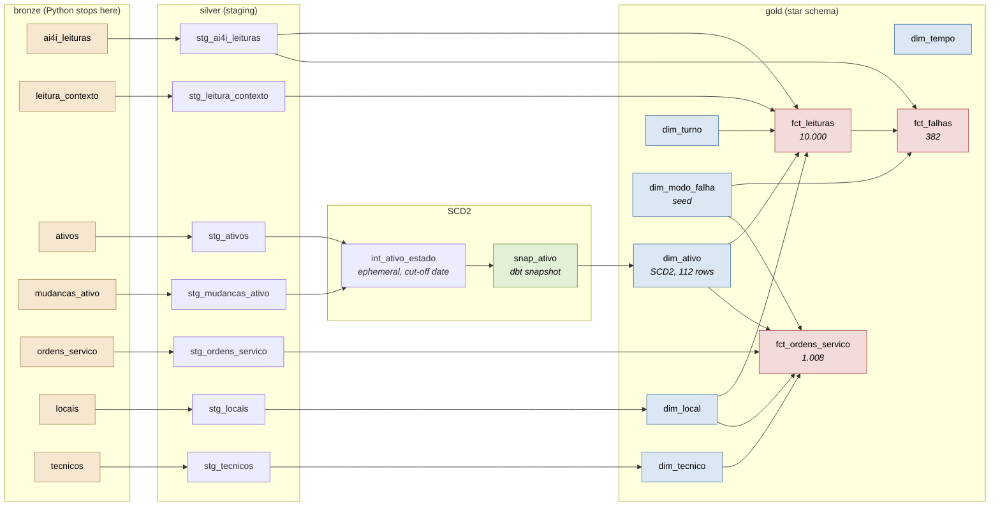

# maintenance-warehouse

A dimensional warehouse for industrial maintenance, built with dbt on PostgreSQL.
Sensor readings come from the public [AI4I 2020 dataset](https://archive.ics.uci.edu/dataset/601/ai4i+2020+predictive+maintenance+dataset)
(UCI, CC BY 4.0); the world around them (machines, calendar, work orders, technicians)
comes from a seeded generator. Python loads raw data into bronze and stops there. From
bronze on, every transformation is a dbt model.

That boundary is the point of the project. There is no `transform.py` here, and its
absence is deliberate: transformation lives in versioned, tested, documented SQL inside
the warehouse.

Portuguese version of this README: coming with the week 4 release.

## Running it

```bash
docker compose up -d                                    # PostgreSQL
uv sync
uv run seed                                             # download, generate, load bronze
uv run --env-file .env dbt deps --project-dir warehouse --profiles-dir warehouse
bash scripts/historico_ativo.sh                         # builds the SCD2 history
uv run --env-file .env dbt build --project-dir warehouse --profiles-dir warehouse
```

The fourth step is not optional and it is not a wrapper around `dbt build`. A dbt
snapshot records what it sees when it runs, and `bronze.ativos` is static after load: the
31 registered cadastre changes do not become history on their own. The script shows dbt
the fleet as it stood on each change date, in ascending order, so the snapshot opens a
real version each time. Skipping it leaves one version per machine and a past that never
happened, so a test counts the versions and fails the build if the loop was skipped.

`uv run seed --sem-sujeira` loads the same data with the injected dirt turned off. The
build then goes to zero warnings, which is how the tests prove they are measuring
something.

## Lineage



For the navigable version with column-level docs and test coverage:

```bash
uv run --env-file .env dbt docs generate --project-dir warehouse --profiles-dir warehouse
uv run --env-file .env dbt docs serve    --project-dir warehouse --profiles-dir warehouse
```

## The star

Three facts and six dimensions. Grains are declared in
[`docs/modelo-dimensional.md`](docs/modelo-dimensional.md), along with what each grain
cannot answer, which matters as much as what it can.

| Table | Grain | Rows |
|---|---|---|
| `fct_leituras` | one operating cycle of one machine | 10.000 |
| `fct_falhas` | one failure mode of one reading | 382 |
| `fct_ordens_servico` | one work order | 1.008 |
| `dim_ativo` | one version of one machine over a validity range (**SCD2**) | 112 |
| `dim_tempo` | one day | 1.097 |
| `dim_local` | one production line | 13 |
| `dim_tecnico` | one technician | 13 |
| `dim_modo_falha` | one failure mode | 7 |
| `dim_turno` | one work shift | 3 |

Facts never join a dimension by its natural key. `dim_ativo` holds 111 versions of 80
machines, so `MAQ-066` alone identifies four rows. Resolving the key by natural code
instead of by the version valid on the event date turns 10.000 readings into 14.329, and
nothing errors: the cost just comes out higher.

## What the tests cover

240 nodes in the build. With the injected dirt in place: 229 pass, 11 warn, 0 error.
With `--sem-sujeira`: 240 pass, 0 warn.

Every warning has an owner and an audited baseline written into the test itself, so a
known problem stays yellow and a growing one turns red:

| Rule | Baseline |
|---|---|
| work order points to an existing machine | 8 orphans |
| work order points to an existing technician | 5 orphans |
| completion does not precede opening | 10 inverted dates |
| parts cost is not negative | 10 negative costs |
| machine does not produce before being installed | 5 machines |
| corrective order points to a reading marked as a failure | must be 0 |
| documented physical rules reproduce the labelled modes | must be 0 |

That last one is the interesting one. HDF, OSF and PWF reproduce the dataset's own labels
exactly, in both directions, from measures the warehouse derives itself. Getting there
required reproducing the source's floating point arithmetic: see the note on 8.6 not
being equal to 8.6 in [`docs/decisions.md`](docs/decisions.md).

## Honest limits

- The world around the AI4I readings is synthetic. Machines, timestamps, shifts, work
  orders, costs and technicians were generated with a fixed seed, calibrated against
  field experience, and none of it is a measurement of anything real.
- The warehouse counts 357 failures where the dataset publishes 339. The definition here
  is "an event that sent a technician to the machine", which is a maintenance
  warehouse's definition, not a classification dataset's label. Both columns sit side by
  side in `fct_leituras`.
- MTBF is measured in calendar days, not machine running hours. The source has one row
  per cycle with no duration, so running hours do not exist in this data.
- Refurbishment does not reduce failures in this dataset, because the generator does not
  model that. The SCD2 demonstration in
  [`warehouse/analyses/demonstracao_scd2.sql`](warehouse/analyses/demonstracao_scd2.sql)
  shows that the question **can be asked**, not that the answer is yes.

## Documentation

| File | What is in it |
|---|---|
| [`docs/PLANO.md`](docs/PLANO.md) | the four week plan, with checkpoints |
| [`docs/decisions.md`](docs/decisions.md) | every decision, with the rejected alternative and why |
| [`docs/modelo-dimensional.md`](docs/modelo-dimensional.md) | grains, bus matrix, business questions |
| [`docs/fonte-ai4i.md`](docs/fonte-ai4i.md) | what the source actually contains, verified |

## Status

Weeks 1 to 3 are done: bronze, silver, and the gold star schema with SCD2, tests and
docs. Week 4 brings the five business questions in commented SQL, the Portuguese README,
and the release write-up.
