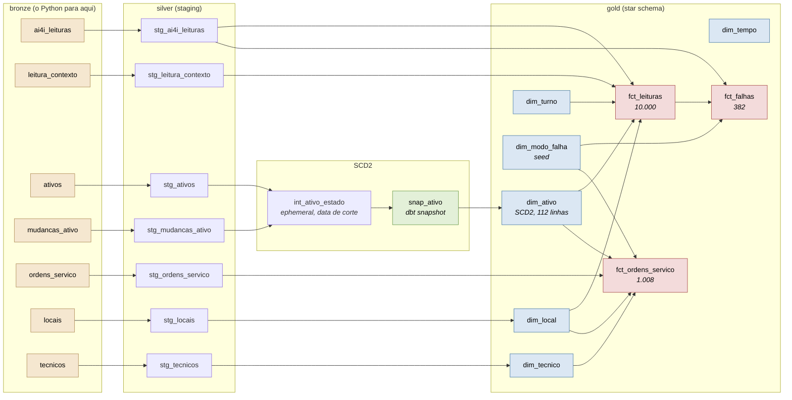

# maintenance-warehouse

Um warehouse dimensional de manutenção industrial, construído com dbt sobre PostgreSQL.
As leituras de sensor vêm do [dataset público AI4I 2020](https://archive.ics.uci.edu/dataset/601/ai4i+2020+predictive+maintenance+dataset)
(UCI, CC BY 4.0); o mundo em volta delas (máquinas, calendário, ordens de serviço,
técnicos) vem de um gerador com semente fixa. O Python carrega o dado bruto na bronze e
para por ali. Da bronze em diante, toda transformação é um modelo dbt.

Essa fronteira é o assunto do projeto. Não existe um `transform.py` aqui, e a ausência
dele é de propósito: a transformação mora em SQL versionado, testado e documentado,
dentro do warehouse.

[English version](README.md)

## Como rodar

```bash
docker compose up -d                                    # PostgreSQL
uv sync
uv run seed                                             # baixa, gera e carrega a bronze
uv run --env-file .env dbt deps --project-dir warehouse --profiles-dir warehouse
bash scripts/historico_ativo.sh                         # constrói o histórico da SCD2
uv run --env-file .env dbt build --project-dir warehouse --profiles-dir warehouse
```

O quarto passo não é opcional e não é um embrulho em volta do `dbt build`. Um snapshot do
dbt registra o que ele vê no momento em que roda, e a `bronze.ativos` é estática depois da
carga: as 31 mudanças de cadastro registradas não viram histórico sozinhas. O script mostra
ao dbt como o parque estava em cada data de mudança, em ordem crescente, e assim o snapshot
abre uma versão de verdade a cada rodada. Pular o script deixa uma versão por máquina e um
passado que nunca aconteceu, então um teste conta as versões e derruba o build se o laço
não rodou.

Esse passo roda o `dbt snapshot` 32 vezes e leva uns quatro minutos. Todo o resto do
bloco acima termina em segundos, então se parecer travado, não está.

`uv run seed --sem-sujeira` carrega o mesmo dado com a sujeira injetada desligada. O build
vai a zero avisos, e é assim que os testes provam que estão medindo alguma coisa.

## Lineage



Para a versão navegável, com documentação por coluna e cobertura de teste:

```bash
uv run --env-file .env dbt docs generate --project-dir warehouse --profiles-dir warehouse
uv run --env-file .env dbt docs serve    --project-dir warehouse --profiles-dir warehouse
```

## O star

Três fatos e seis dimensões. Os grains estão declarados em
[`docs/modelo-dimensional.md`](docs/modelo-dimensional.md), junto com o que cada grain
**não** consegue responder, que importa tanto quanto o que ele responde.

| Tabela | Grain | Linhas |
|---|---|---|
| `fct_leituras` | um ciclo de operação de uma máquina | 10.000 |
| `fct_falhas` | um modo de falha de uma leitura | 382 |
| `fct_ordens_servico` | uma ordem de serviço | 1.008 |
| `dim_ativo` | uma versão de uma máquina num intervalo de validade (**SCD2**) | 112 |
| `dim_tempo` | um dia | 1.097 |
| `dim_local` | uma linha de produção | 13 |
| `dim_tecnico` | um técnico | 13 |
| `dim_modo_falha` | um modo de falha | 7 |
| `dim_turno` | um turno de trabalho | 3 |

Fato nunca casa com dimensão pelo código natural. A `dim_ativo` guarda 111 versões de 80
máquinas, então `MAQ-066` sozinha identifica quatro linhas. Resolver a chave pelo código
natural em vez da versão vigente na data do evento transforma 10.000 leituras em 14.329, e
nada dá erro: o custo só sai mais alto.

## As cinco perguntas

O warehouse existe para ser consultado, e
[`warehouse/analyses/perguntas_negocio.sql`](warehouse/analyses/perguntas_negocio.sql)
é onde isso acontece: cinco perguntas, cada uma com o SQL, o raciocínio por trás de cada
definição que ela precisou, e a saída real do psql colada logo abaixo.

| # | Pergunta | O que saiu |
|---|---|---|
| 1 | MTBF e MTTR por criticidade | Máquina de criticidade alta falha **menos**: 184,6 dias entre falhas contra 146,5 da criticidade baixa. E não é por ser mais bem cuidada. |
| 2 | Setores que concentram custo de corretiva | A Usinagem tem 40,8% do custo e roda 39,9% dos ciclos, então ela é grande, não é cara. Quem destoa é a Montagem, com R$ 84.039 por mil ciclos contra R$ 46.090 do Acabamento. |
| 3 | Modo de falha que mais para máquina por hora parada | Os dois ranqueamentos são quase inversos. O HDF é 30,5% das ordens e 19,4% das horas paradas; o OSF é 26,6% das ordens e 40,0% das horas. |
| 4 | Preventiva em dia reduz corretiva no trimestre seguinte | **Não**, e o agregado dizia que sim. |
| 5 | Evolução do custo por máquina depois da reforma | Três sobem e três descem. O que vale é que a pergunta pode ser feita. |

Três dessas cinco respostas acabam medindo a mesma coisa por caminhos diferentes, e não é
manutenção. O AI4I faz o limite do OSF depender do tipo da peça, então máquina tipo L
falha mais (4,12% contra 2,49% da H) e 87 das 98 ocorrências de OSF acontecem em L. O OSF
também é o reparo mais caro do parque: R$ 2.967,64 de peça em média contra R$ 643,26 do
HDF. O gerador então sorteia a criticidade de cada máquina **a partir do tipo dela**, e
espalha as máquinas pelas linhas de produção ao acaso. A pergunta 1 lê essa cadeia como
criticidade e a pergunta 2 lê como setor. Das três, só a 3 é de manutenção de verdade.

A pergunta 4 é a que vale ler inteira. O agregado saiu em ordem perfeita: 0,540 corretiva
no trimestre seguinte quando a preventiva foi feita em dia, 0,661 quando atrasou, 0,758
quando não aconteceu. Escrito assim, isso é "fazer preventiva em dia reduz corretiva em
29%", e cada número da frase é verdadeiro.

Cortar o mesmo resultado por trimestre derruba a conclusão. Um par de trimestres carrega
o gradiente inteiro, e tirá-lo inverte a ordem: as máquinas que **não** fizeram a
preventiva passam a ter a menor taxa de corretiva depois. O trimestre é o 4º de 2024, que
tem 146 corretivas contra cerca de 30 em cada um dos outros sete. Não aconteceu nada com
aquelas máquinas, e o motivo está nos limites, mais abaixo.

## O que os testes cobrem

240 nós no build. Com a sujeira injetada no lugar: 229 passam, 11 avisam, 0 erram. Com
`--sem-sujeira`: 240 passam, 0 avisos.

Todo aviso tem dono e uma linha de base auditada escrita dentro do próprio teste, então
problema conhecido fica amarelo e problema que cresce fica vermelho:

| Regra | Linha de base |
|---|---|
| ordem aponta para máquina existente | 8 órfãs |
| ordem aponta para técnico existente | 5 órfãs |
| conclusão não precede a abertura | 10 datas invertidas |
| custo de peça não é negativo | 10 custos negativos |
| máquina não produz antes de ser instalada | 5 máquinas |
| corretiva aponta para leitura marcada como falha | tem que ser 0 |
| regras físicas documentadas reproduzem os modos rotulados | tem que ser 0 |

A última é a interessante. HDF, OSF e PWF reproduzem os próprios rótulos do dataset
exatamente, nas duas direções, a partir de medidas que o warehouse deriva sozinho. Chegar
lá exigiu reproduzir a aritmética de ponto flutuante da fonte, que é a seção seguinte.

## O dia em que 8,6 não foi igual a 8,6

As regras físicas do AI4I foram conferidas à mão na Semana 1 e escritas em
[`docs/fonte-ai4i.md`](docs/fonte-ai4i.md): HDF 115 de 115, OSF 98 de 98, PWF 95 de 95. A
Semana 3 transformou aquela conferência em teste do build. Ele falhou, com 12 linhas,
todas marcadas como HDF pela fonte enquanto a regra dizia que não eram.

As 12 tinham diferença de temperatura de exatamente 8,6, e a regra do dataset é "abaixo de
8,6". A correção óbvia foi trocar o `<` por `<=`. Ela consertou as 12 e criou 15 do outro
lado: leituras com diferença de exatamente 8,6 que **não** são HDF. Nenhum limiar decimal
separa os dois grupos, porque em decimal não há nada ali para separar.

Refazer a subtração em ponto flutuante mostra por quê:

```
309.4 - 300.8 = 8.599999999999966   abaixo de 8,6  -> é HDF
311.0 - 302.4 = 8.600000000000023   acima de 8,6   -> não é HDF
```

As duas dão exatamente 8,6 em decimal. O AI4I produziu os rótulos dele em ponto flutuante
binário, onde o erro de arredondamento muda de direção conforme o par de números que se
subtrai. A camada silver converte para `numeric`, que é decimal exato, e em decimal exato
a diferença entre esses dois casos **não existe**.

A correção foi fazer o teste converter de volta para `float8`, e deixar o warehouse em
paz. O `numeric` está certo: medição e dinheiro pedem decimal exato, e trocar o tipo do
warehouse inteiro para salvar uma comparação seria deixar a cauda balançar o cachorro. O
teste está conferindo o rótulo **da fonte**, então ele precisa refazer a aritmética **da
fonte**. Esse motivo está escrito dentro do teste, com os dois números, para ninguém
"consertar" aquele cast depois.

### A outra, em que nada ficou vermelho

O histórico da SCD2 é construído por um laço de `dbt snapshot`, uma rodada por data de
mudança. Ele funcionou na primeira tentativa e produziu 110 versões, onde a conta dizia
111: 80 máquinas mais 31 mudanças registradas.

A `MAQ-066` tinha três mudanças e só três versões. A primeira mudança dela caiu em
2024-03-04, que é a data de mudança mais antiga do parque inteiro e portanto a primeira
data de corte do laço. A primeira rodada do snapshot já a viu alterada, então o estado
original dela nunca chegou a ser gravado.

A correção não foi cravar uma data. O laço passou a rodar 32 vezes em vez de 31: o dia
anterior à primeira mudança, que grava a linha de base, mais as 31 datas de mudança. Essa
data de base é calculada como `min(data_mudanca) - 1`, para o laço continuar certo se a
semente do gerador mudar.

Das duas histórias, essa é a mais útil. Nada falhou, nada ficou vermelho, e a única pista
foi uma contagem um número abaixo do esperado, numa conferência que só existia porque
alguém escreveu quanto deveria dar antes de rodar qualquer coisa. Sem ela, a `MAQ-066`
teria entrado no warehouse tendo nascido na linha USI-L04, e toda resposta sobre o passado
dela estaria errada com toda a confiança do mundo.

## Limites honestos

- O mundo em volta das leituras do AI4I é sintético. Máquinas, instantes, turnos, ordens
  de serviço, custos e técnicos foram gerados com semente fixa, calibrados pela vivência
  de campo, e nada disso é medição de coisa nenhuma.
- O warehouse conta 357 falhas onde o dataset publica 339. A definição aqui é "evento que
  levou um técnico até a máquina", que é a definição de um warehouse de manutenção e não
  o rótulo de um dataset de classificação. As duas colunas ficam lado a lado no
  `fct_leituras`.
- O MTBF é medido em dias de calendário, e não em horas de máquina ligada. A fonte tem uma
  linha por ciclo e nenhuma duração, então hora de operação não existe neste dado.
- O eixo de tempo herda a ordem das linhas do arquivo da fonte. O gerador atribui os
  instantes em ordem estrita de UDI, e o AI4I concentra 134 falhas entre os UDI 4000 e
  4999, então o 4º trimestre de 2024 sai com 11,56% de taxa de falha contra uma linha de
  base de uns 2,5%. Qualquer tendência temporal deste warehouse carrega isso junto, e é
  por isso que a pergunta 4 responde com e sem aquele trimestre.
- Criticidade, setor e tipo de máquina não são independentes aqui. O gerador sorteia a
  criticidade a partir do tipo da máquina, e o AI4I amarra o limite do OSF ao tipo da
  peça, então resposta agrupada por criticidade ou por setor está lendo em parte a mesma
  propriedade com dois nomes diferentes.
- Reforma não reduz falha neste dataset, porque o gerador não modela isso. A demonstração
  da SCD2 em
  [`warehouse/analyses/demonstracao_scd2.sql`](warehouse/analyses/demonstracao_scd2.sql)
  mostra que a pergunta **pode ser feita**, e não que a resposta é sim.

## Documentação

| Arquivo | O que tem dentro |
|---|---|
| [`docs/PLANO.md`](docs/PLANO.md) | o plano das quatro semanas, com os checkpoints |
| [`docs/decisions.md`](docs/decisions.md) | cada decisão, com a alternativa rejeitada e o porquê |
| [`docs/modelo-dimensional.md`](docs/modelo-dimensional.md) | grains, bus matrix, perguntas de negócio |
| [`docs/fonte-ai4i.md`](docs/fonte-ai4i.md) | o que a fonte tem de verdade, conferido |
| [`warehouse/analyses/`](warehouse/analyses/) | as cinco perguntas de negócio, e a demonstração da SCD2 |

## Status

As quatro semanas estão fechadas: bronze, silver, o star schema da gold com SCD2, 240 nós
no build, e as cinco perguntas de negócio respondidas em SQL comentado. O que sobra é
opcional, e sempre foi a primeira coisa a cortar: um serviço do Metabase lendo a gold.
